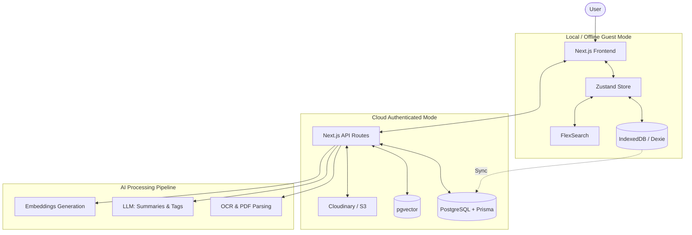

# 🧠 SecondBrain

**An AI-Powered Offline-First Knowledge Vault**

SecondBrain is not just a bookmark manager; it is an intelligent personal knowledge vault that automatically organizes everything you save. From websites and PDFs to images and markdown files, SecondBrain automatically understands, categorizes, summarizes, and extracts useful information, making it effortlessly searchable using AI.

---

## 🌟 Core Philosophy

- **Offline First:** Use the entire application without creating an account. Guest Mode works completely offline using IndexedDB.
- **Privacy Focused:** Authentication is strictly optional.
- **Progressive Enhancement:** If you choose to sign in, your local resources securely sync to the cloud. The cloud is an enhancement, not a requirement.

---

## ✨ Features

- **Multi-Format Support:** Upload Links, PDFs, Images, Screenshots, and Markdown files. (Browser extension, GitHub repos, YouTube videos coming soon).
- **Intelligent Ingestion Pipeline:** 
  - Automatic detection of resource type.
  - OCR for images & screenshots (extracting text, URLs, tech stacks).
  - AI-powered summaries, tag generation, and category detection.
  - Embeddings generation for semantic search.
- **Advanced Search:** Keyword search, Natural Language Search, and Semantic Search.
- **AI-Assisted Collections:** Auto-organized collections for AI, Frontend, Backend, DevOps, Research, and more.
- **Premium UI/UX:** A minimal, responsive interface with keyboard shortcuts, command palette, smooth animations, and dark mode. Inspired by Linear, Notion, Raycast, and Arc.

---

## 🏗 System Architecture

SecondBrain is designed with an **Offline-First / Local-First** architecture, ensuring privacy, speed, and reliability.

### High-Level Flow
1. **Client Layer:** Next.js App Router (React) built with Tailwind CSS & shadcn/ui. State managed by Zustand.
2. **Offline Storage (Guest Mode):** Data is stored locally in the browser using IndexedDB (via Dexie.js). Search is powered locally by FlexSearch.
3. **Cloud Sync (Authenticated):** When signed in, local data syncs with the remote PostgreSQL database (via Prisma). Files are uploaded to S3 / Cloudinary.
4. **AI Processing Pipeline:** 
   - **Ingestion:** Raw resources (links, images, PDFs, text) are processed via Web Workers or API routes.
   - **Extraction:** OCR via Tesseract.js, PDF parsing via pdf.js.
   - **Enrichment:** LLMs generate summaries, extract tags, and categorize content.
   - **Vectorization:** Embeddings are generated and stored in pgvector for semantic search.



---

## 🛠 Tech Stack

**Frontend:** Next.js (App Router), TypeScript, Tailwind CSS, shadcn/ui, Framer Motion, Zustand, React Hook Form, Zod  
**Guest Database (Offline):** IndexedDB, Dexie.js  
**Cloud Database:** PostgreSQL, Prisma  
**Storage:** Cloudinary / S3  
**Search:** FlexSearch (Local), pgvector (Cloud)  
**AI & OCR:** OpenAI / Gemini / OpenRouter, Tesseract.js, pdf.js  

---

## 🚀 Getting Started

First, install dependencies (if you haven't already):

```bash
npm install
# or
yarn install
# or
pnpm install
```

Then, run the development server:

```bash
npm run dev
# or
yarn dev
# or
pnpm dev
# or
bun dev
```

Open [http://localhost:3000](http://localhost:3000) with your browser to see the result. You can start editing the page by modifying `app/page.tsx`.

---
## 🗺 Roadmap (Future Features)

- [ ] Chrome Extension & Mobile App
- [ ] Browser Bookmark & Notion Import
- [ ] Google Drive Sync
- [ ] AI Chat with Resources
- [ ] Flashcards & Quiz Generation
- [ ] Vector Search & Voice Notes

---
## 🤝 Architecture & Code Quality

Use feature-based architecture. Avoid large components. Keep business logic separate from UI. Always optimize for scalability, extensibility, and an exceptional developer experience.

*Built with passion, engineered for scale.*
